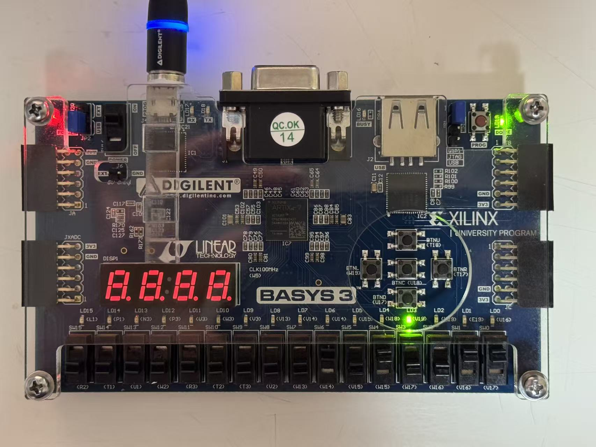
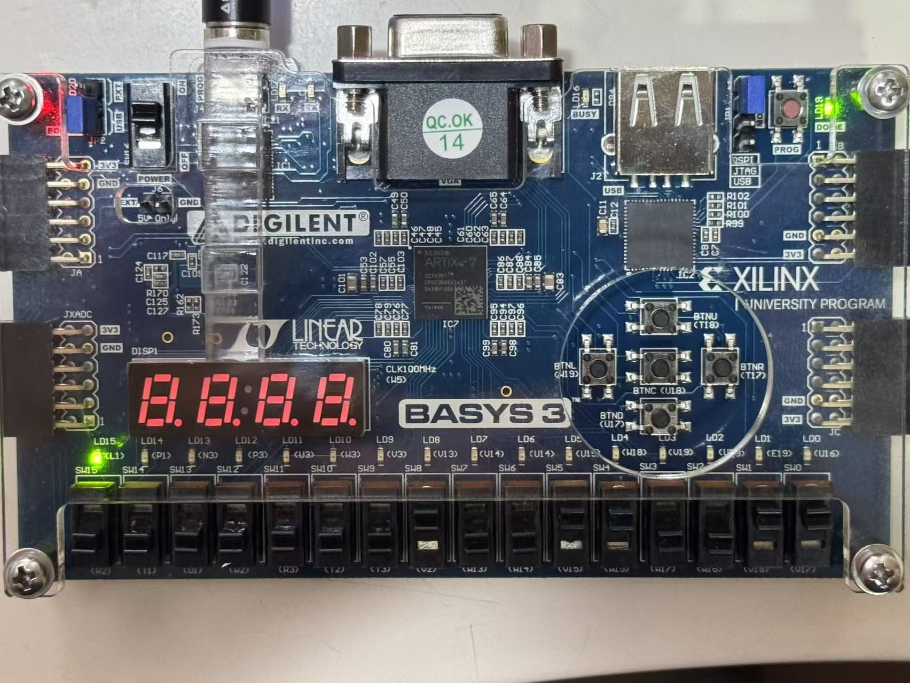

# Build log

Day-by-day record of building the RV32I core: what got written, what broke, and how each bug was found. Moved out of `README.md` on 2026-08-15 so the README can stay a 30-second overview.

Newest entry at the bottom.

---

## Day 0 (2026-07-09) — repository setup

- Initialized this Git repository.
- Created the project README.
- Set up the remote GitHub repository.

---

## Day 1 (2026-07-10) — toolchain bring-up on Basys 3

- Board arrived; completed toolchain bring-up on Basys 3.
- Hit and resolved several environment issues along the way: AMD account profile incomplete (blocked device-file download), 7 Series device support not installed (the board silently disappeared from the New Project wizard), constraint file not actually added to the project (DRC failed with all 32 ports unconstrained).
- `rtl/led_passthrough.v`: minimal combinational design (`assign led = sw`) used purely to validate the toolchain.
- `constraints/basys3_led_test.xdc`: full switch/LED pin mapping for Basys 3 rev B/C.
- Verified on hardware: synthesis → implementation → bitstream → JTAG program; toggling SW0–15 correctly drives LD0–15.

Toolchain confirmed working end-to-end.

---

## Combinational logic & testbench fundamentals

- `rtl/mux2to1.v`: 2-to-1 multiplexer using a ternary `assign`.
- `rtl/adder4bit.v`: 4-bit adder using concatenation (`{cout, sum} = a + b + cin`) to capture the carry-out alongside the sum in one line.
- `rtl/priority_encoder.v`: priority encoder using `casez` with wildcard matching; includes a `default` branch to avoid unintended latch inference.
- Hit and resolved several Verilog syntax issues along the way: missing semicolon after a port list (caused cascading syntax errors on later lines), missing colons in `casez` branches, wrong radix specifier (`'d` used where `'b` was intended), and mismatched signal names between a declaration and an instantiation — Verilog's implicit wire declaration silently created a new signal instead of raising a compile error, which was the most instructive bug of the batch.
- Learned testbench fundamentals: `initial` blocks, `$display` for printing signal values, and DUT instantiation via named port connections (`.port(signal)`).
- `tb/practice/adder4bit_tb.v`: first self-checking testbench. Rather than printing values for manual inspection, it computes the expected sum internally and asserts PASS/FAIL via `if-else` — the self-checking pattern this project treats as a baseline habit going forward.
- Compiled and simulated with Icarus Verilog (`iverilog` + `vvp`); confirmed PASS on the first test case.

---

## Sequential logic exercises

Practice modules covering flip-flop based design before moving to the core proper: a parameterised adder (`adder_n`), a synchronous RAM (`sync_ram`, initialised from `ram_init.hex`), a switch debouncer (`debounce`), and a Moore-machine sequence detector (`seq_detect_moore`). Each has a testbench under `tb/practice/`.

Two mistakes from this batch worth recording, because both produce *plausible-looking* waveforms rather than obvious failures:

**Blocking (`=`) vs non-blocking (`<=`) assignment.** Using `=` inside an `always @(posedge clk)` block makes the assignment take effect immediately, so a later statement in the same block reads the *new* value instead of the value the flip-flop held at the clock edge. In a two-stage shift register this collapses both stages into one — and whether it happens to look right in simulation depends on the order the statements are written in. The rule adopted from here on: sequential `always` blocks use `<=` exclusively, combinational `always` blocks use `=` exclusively, and the two never mix inside one block.

**Synchronous vs asynchronous reset, and the sensitivity list.** An asynchronous reset must appear in the sensitivity list (`always @(posedge clk or negedge rst_n)`); writing the reset check inside a clock-only sensitivity list gives a *synchronous* reset, which does nothing until the next rising clock edge. The bug is easy to miss because in a testbench the clock is usually already running when reset is asserted, so the design does eventually reset — just one cycle later than intended, which only becomes visible when something else depends on that first cycle.

---

## Core modules

- `rtl/alu.v`: RV32I ALU. Started as an 8-bit version while learning, later widened to 32 bits.
- `rtl/regfile.v`: 32×32 register file. `x0` is hardwired to zero, two asynchronous read ports and one synchronous write port.
- `rtl/alu_regfile_top.v`: first multi-module integration — register file feeding the ALU, result written back.

---

## Day 6 · 2026-08-14 — ImmGen, 32-bit ALU, decoder

Three modules committed, all passing self-checking testbenches: `imm_gen.v` (26/26), `alu.v` widened to 32 bits with SRA / SLTU / LUI added (36/36), and `decoder.v` (26/26).

`imm_gen.v` covers all five RV32I immediate formats (I / S / B / U / J), each sign-extended to 32 bits. B-type and J-type have their bits scattered across the instruction word and a hardwired zero in the LSB, so those two carry most of the risk and most of the test cases.

`decoder.v` is two-level: the main decoder maps `opcode` to control signals, and the ALU decoder maps `funct3` / `funct7` — plus the ALUOp hint from the main decoder — to the ALU control code. Two levels rather than one flat table, so that adding an instruction touches one small table instead of the whole decode logic.

### Bug of the day — the test vector itself was wrong

While hand-encoding `beq x1, x2, -8`, the `imm[4:1]` field was written as `1000`; the correct value is `1100`. The cause was skipping the bit-by-bit labelling step and simply taking the last four characters of the binary representation of -8 — those four bits are `imm[3:0]`, not `imm[4:1]`. The whole field was off by one position.

Worth recording because of what it says about self-checking testbenches generally: a self-checking testbench only proves that the DUT agrees with the expected value written in the testbench. It cannot prove the expected value is right. For instruction encodings, where the expected value is hand-derived, the derivation needs its own check — labelling every bit position explicitly before writing the vector, rather than pattern-matching on a bit string.
---

## Day 7 · 2026-08-15 — repository cleanup, and three bugs that were all in the test environment

Rewrote the README around a three-column status table, moved this build log
out of it, sorted the early exercises into `rtl/practice/` and `tb/practice/`,
added a `.gitignore` for simulation artifacts, and tagged `v0.1`.

Three things broke during the cleanup, and none of them was in a design under
test:

1. **A hand-derived expected value was wrong.** Encoding `beq x1, x2, -8`, the
   `imm[4:1]` field was written as the last four bits of -8 — those are
   `imm[3:0]`. Off by one bit position.
2. **Stimulus silently failed to load.** Moving files broke the `$readmemh`
   path in `sync_ram_tb`. `$readmemh` reports a failure and carries on, leaving
   memory as `x`, so twelve checks failed — but the write-then-read check still
   passed, because it never depended on the preloaded contents. A testbench
   with only that one check would have reported success.
3. **Two core testbenches were deleted by accident** during a batch operation,
   and were caught only by reading `git status` line by line before committing.

The common shape: a self-checking testbench proves the DUT agrees with the
expected value written in the testbench. It does not prove the expected value
was derived correctly, that the stimulus actually reached the DUT, or that the
test still exists. Those need their own checks — labelling bit positions
explicitly before writing a vector, and deliberately breaking the DUT once to
confirm the testbench actually reports FAIL.

## 2026-08-18　ALU 上板

把 `alu.v` 综合到 Basys 3（xc7a35tcpg236-1），用拨码开关输入、LED 读结果，
在真实硬件上覆盖了算术、逻辑、移位、比较、zero 标志五类通路。

之前只有 LED 直通上过板（7 月），验的是工具链；这次验的是自己写的 RTL。

### 引脚分配

| 开关 | 用途 |
|---|---|
| SW3–SW0 | 操作数 A（低 4 位，高位补零到 32 位） |
| SW7–SW4 | 操作数 B |
| SW11–SW8 | `alu_op` 操作码 |
| SW15–SW12 | 未使用 |

| LED | 含义 |
|---|---|
| LD14–LD0 | `result[14:0]` |
| LD15 | `zero` 标志 |

### alu_op 编码

| 码 | 操作 | 码 | 操作 |
|---|---|---|---|
| `0000` | ADD | `0110` | SLL |
| `0001` | SUB | `0111` | SRL |
| `0010` | AND | `1000` | SRA |
| `0011` | OR | `1001` | SLTU |
| `0100` | XOR | `1010` | LUI |
| `0101` | SLT | | |

### 板级测试用例

| A | B | op | 预期 | 结果 |
|---|---|---|---|---|
| 3 | 5 | ADD | LD3（8） | ✅ |
| 5 | 3 | SUB | LD1（2） | ✅ |
| 3 | 3 | SUB | 全灭 + LD15 | ✅ |
| `1100` | `1010` | AND | LD3（8） | ✅ |
| `1100` | `1010` | OR | LD3/2/1（14） | ✅ |
| 1 | 3 | SLL | LD3（8） | ✅ |
| 3 | 5 | SLT | LD0（1） | ✅ |
| 7 | 1 | ADD | LD3（8） | ✅ |

### 综合资源（Report Utilization）

| 项 | 用量 | 可用 | 占比 |
|---|---|---|---|
| Slice LUTs | 81 | 20800 | 1% |
| F7 Muxes | 4 | 16300 | <1% |
| F8 Muxes | 2 | 8150 | <1% |
| Bonded IOB | 28 | 106 | 26% |
| Slice Registers | 0 | 41600 | 0% |

几点观察：

- 81 个 LUT 里，吃掉大头的是加法器进位链和三个 32 位移位器（SLL/SRL/SRA）；
  AND/OR/XOR/LUI 这些纯位运算几乎不占资源。
- F7/F8 MUX 是 Xilinx 专门拼宽多路选择器的硬件资源。`case (alu_op)` 有 11 个分支，
  综合器把它实现成一棵 MUX 树，宽到单个 LUT 装不下时借用 F7/F8。
- **Slice Registers = 0** 是重要的健康指标：ALU 是纯组合逻辑，不该有任何触发器。
  若不为 0，说明 `case` 缺分支导致综合器推断出了锁存器（latch）——这是 Verilog
  组合逻辑最常见的隐蔽 bug。这里因为写了 `default` 分支，没踩到。

### 坑

无。整个流程一次通过。

Vivado 的 GUI 层级较深是唯一的实际阻力——Report Utilization 藏在
Open Synthesized Design 之后才出现的二级菜单里，第一次找花了些时间。
不是技术问题，是工具熟悉度问题。